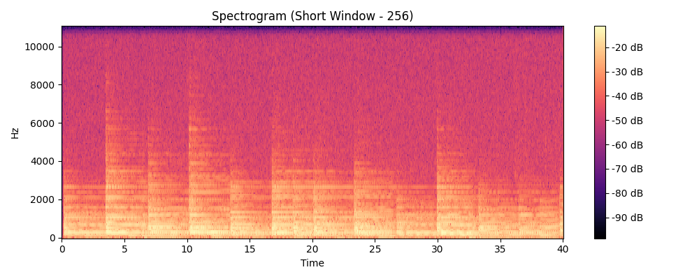
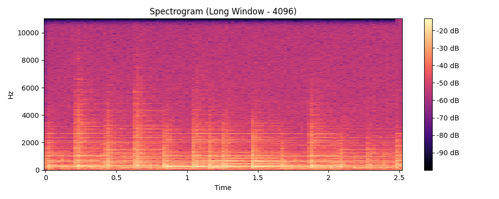
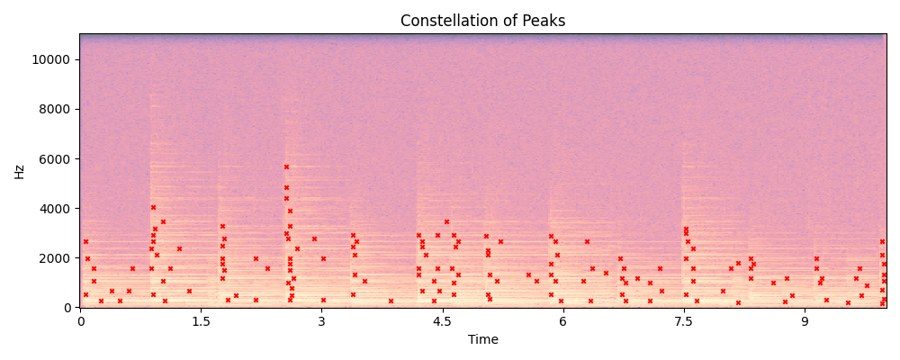

# Sonic Signatures & Signals to Softwares

## 1. Spectrogram Analysis & Window Length
The Short-Time Fourier Transform (STFT) splits the signal into overlapping windowed segments to analyze how frequencies change over time.

- **Short Window (256 samples):** Provides excellent **time resolution**, meaning we can clearly see exactly *when* transient sounds (like drum hits) occur. However, it suffers from poor frequency resolution, making harmonic bands appear blurry. As seen in the plot, the vertical lines (transients) are sharp, but the horizontal frequency lines are smeared.

- **Long Window (4096 samples):** Provides excellent **frequency resolution**, revealing steady horizontal harmonic bands and individual notes clearly. However, it suffers from poor time resolution, making the exact start and end times of notes blurry. As seen in the plot, the horizontal frequency lines are sharp, but the vertical timing is smeared.

For our fingerprinting task, a balanced window (e.g., 1024 samples) is used to accurately pinpoint both the time and frequency of acoustic peaks.

## 2. Fingerprint Extraction (Constellation)
Rather than comparing raw spectrograms, we extract a sparse "constellation" of points. By applying a 2D local maximum filter and a threshold (90th percentile), we isolate only the strongest, most prominent time-frequency peaks. This heavily reduces the data size while preserving the unique structural acoustic "fingerprint" of the song.

The constellation plot above highlights the extracted peaks (red markers) overlaid on the spectrogram. These peaks are the most prominent frequency components at their respective times, forming the unique signature we use for matching.

## 3. Peak Hashing (Single Peaks vs. Paired Hashes)
- **Single Peaks:** If we used single peaks `(frequency)` as fingerprints, there would be massive overlap between songs. Many songs share the exact same frequencies at different times, leading to millions of false positive matches and a flat, noisy offset histogram.
- **Paired Hashes:** By pairing a peak with another peak occurring shortly after it, we create a hash `(f1, f2, delta_t)`. This incorporates the *time-evolution* of the sound. The probability of two different songs having the exact same two frequencies separated by the exact same time gap is exponentially smaller, making correct matches far more decisive in the offset histogram.

## 4. Robustness Experiments
We tested our identifier against audio distortions using a 5-second snippet of *Let It Be*:
1. **White Noise Addition:** The identifier **successfully matched** the noisy snippet to *Let It Be*. Since we only extract the strongest local maxima, the background noise floor does not overwrite the prominent peaks that define the constellation.
2. **Pitch Shifting:** We pitched the snippet up by 1 semitone. Initially, the identifier **failed**, matching incorrectly.
   - **Why it failed:** Pitch shifting multiplies all frequencies by a constant factor. Our initial hash `(f1, f2, delta_t)` relied on *absolute* frequencies. Since all frequencies shifted, none of the hashes matched the database.
   - **Implemented Solution:** We modified the hashing algorithm to use the **ratio** of the frequencies `(f2 / f1, delta_t)`. Because pitch shifting scales all frequencies equally, the scaling factor cancels out in the ratio. After implementing this, the pitch-shifted snippet successfully matched *Let It Be*!

## 5. Web Application (Streamlit)
The identifier has been wrapped in an interactive Streamlit application.
- **Single-Clip Mode:** Upload an audio file to view its computed Spectrogram, the Extracted Constellation of peaks, the Offset Histogram, and the final matched song prediction.
- **Batch Mode:** Upload multiple audio files simultaneously to process them in bulk and download the resulting `results.csv` file.

**Source Code:** Available in this repository.
